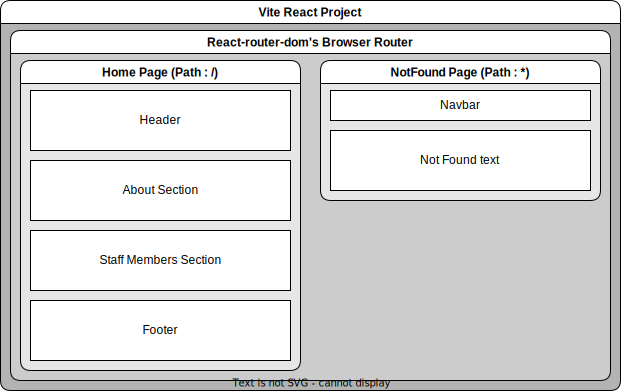

# JLM - ENSA Khouribga

This repository contains the source code for our college club's official website. The website serves as a hub for showcasing our activities, events, and achievements while providing information to current and prospective members.

## Tech Stack
This project was built and tested with the following tech stack :
- **Runtime Environment:** Node.js `v23.7.0`
- **Framework:** ReactJS `v19.0.0`, Vite `v6.1.0`
- **Styling:** TailwindCSS `v4.0.4`

## React Structure


## Setup  
1. Clone the repo:  
```sh
git clone https://github.com/jlm-ensakh/jlm-ensakh.github.io
cd jlm-ensakh.github.io
```

2. Install dependencies:
```sh
npm install  # or yarn install
```

3. Start the development server:
```sh
npm run dev  # or yarn dev
```
